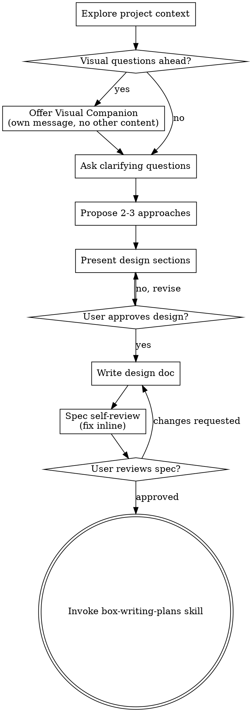

# Brainstorming Ideas Into Designs

Help turn ideas into fully formed designs and specs through natural collaborative dialogue.

Start by understanding the current project context, then ask questions one at a time to refine the idea. Once you understand what you're building, present the design and get user approval.

<HARD-GATE>
Do NOT invoke any implementation skill, write any code, scaffold any project, or take any implementation action until you have presented a design and the user has approved it. This applies to EVERY project regardless of perceived simplicity.
</HARD-GATE>

## Anti-Pattern: "This Is Too Simple To Need A Design"

Every project goes through this process. A todo list, a single-function utility, a config change — all of them. "Simple" projects are where unexamined assumptions cause the most wasted work. The design can be short (a few sentences for truly simple projects), but you MUST present it and get approval.

## Checklist

You MUST create a task for each of these items and complete them in order:

1. **Explore project context** — check files, docs, recent commits; detect project doc structure
2. **Offer visual companion** (if topic will involve visual questions) — this is its own message, not combined with a clarifying question. See the Visual Companion section below.
3. **Ask clarifying questions** — one at a time, understand purpose/constraints/success criteria
4. **Propose 2-3 approaches** — with trade-offs and your recommendation
5. **Present design** — in sections scaled to their complexity, get user approval after each section
6. **Write design doc** — detect project doc structure and save to the right path (see Documentation section below); commit
7. **Add Validator Acceptance Scenarios** — if project has `app/validators/`, add a validator scenario list section to the spec (see below)
8. **Spec self-review** — quick inline check for placeholders, contradictions, ambiguity, scope (see below)
9. **User reviews written spec** — ask user to review the spec file before proceeding
10. **Transition to implementation** — invoke box-writing-plans skill to create implementation plan

## Process Flow



**The terminal state is invoking box-writing-plans.** Do NOT invoke frontend-design, mcp-builder, or any other implementation skill. The ONLY skill you invoke after brainstorming is box-writing-plans.

## The Process

**Understanding the idea:**

- Check out the current project state first (files, docs, recent commits)
- Before asking detailed questions, assess scope: if the request describes multiple independent subsystems (e.g., "build a platform with chat, file storage, billing, and analytics"), flag this immediately. Don't spend questions refining details of a project that needs to be decomposed first.
- If the project is too large for a single spec, help the user decompose into sub-projects: what are the independent pieces, how do they relate, what order should they be built? Then brainstorm the first sub-project through the normal design flow. Each sub-project gets its own spec → plan → implementation cycle.
- For appropriately-scoped projects, ask questions one at a time to refine the idea
- Prefer multiple choice questions when possible, but open-ended is fine too
- Only one question per message - if a topic needs more exploration, break it into multiple questions
- Focus on understanding: purpose, constraints, success criteria

**Exploring approaches:**

- Propose 2-3 different approaches with trade-offs
- Present options conversationally with your recommendation and reasoning
- Lead with your recommended option and explain why

**Presenting the design:**

- Once you believe you understand what you're building, present the design
- Scale each section to its complexity: a few sentences if straightforward, up to 200-300 words if nuanced
- Ask after each section whether it looks right so far
- Cover: architecture, components, data flow, error handling, testing
- Be ready to go back and clarify if something doesn't make sense

**Design for isolation and clarity:**

- Break the system into smaller units that each have one clear purpose, communicate through well-defined interfaces, and can be understood and tested independently
- For each unit, you should be able to answer: what does it do, how do you use it, and what does it depend on?
- Can someone understand what a unit does without reading its internals? Can you change the internals without breaking consumers? If not, the boundaries need work.
- Smaller, well-bounded units are also easier for you to work with - you reason better about code you can hold in context at once, and your edits are more reliable when files are focused. When a file grows large, that's often a signal that it's doing too much.

**Working in existing codebases:**

- Explore the current structure before proposing changes. Follow existing patterns.
- Where existing code has problems that affect the work (e.g., a file that's grown too large, unclear boundaries, tangled responsibilities), include targeted improvements as part of the design - the way a good developer improves code they're working in.
- Don't propose unrelated refactoring. Stay focused on what serves the current goal.

## After the Design

**Documentation:**

Detect the project's doc structure before writing the spec. Check which of these paths exists:

```
docs/architecture/   → primary spec location (most design docs go here)
docs/decisions/      → use for Architecture Decision Records (ADRs), i.e. "we chose X over Y because..."
docs/superpowers/specs/  → legacy fallback only if the above don't exist
```

**Decision rule:**
- If the spec describes a **new architectural pattern, technical approach, or system-wide decision** → write as ADR to `docs/decisions/ADR-NNN-<topic>.md` (find next ADR number first)
- Otherwise → write to `docs/architecture/YYYY-MM-DD-<topic>-design.md`
- If neither `docs/architecture/` nor `docs/decisions/` exist → fall back to `docs/superpowers/specs/YYYY-MM-DD-<topic>-design.md`
- User preferences for spec location always override these defaults

- Use elements-of-style:writing-clearly-and-concisely skill if available
- Commit the design document to git

**Validator Acceptance Scenarios (Agent Benchmark 项目专用):**

Check if the project has an `app/validators/` directory. If yes, this is an Agent Benchmark sandbox project — add a **Validator Acceptance Scenarios** section to the spec.

This section captures acceptance scenarios in plain human language *before* any code is written. The goal: define what "done" looks like from a user/agent perspective. These scenarios become the source of truth for validator code written later (after implementation).

**What to write:**
- List 3–8 key scenarios for the feature being designed
- Write each as a natural language task description (same format as validator titles: `给/帮 [用户] + 动词 + 目标 + 约束`)
- For each scenario, note: what data must exist (baseline), what action the agent takes, what DB state proves success
- Do NOT write Ruby code here — this is the human-readable spec, not the implementation

**Template to append to the spec file:**

```markdown
## Validator Acceptance Scenarios

> 功能完成后，参照此清单生成 validator 代码（使用 box-validator-generator skill）。
> 人工校验：实现完成后逐条确认场景是否覆盖，补充遗漏场景，再生成代码。

| # | 场景描述（validator title 格式） | 前置数据 | 验证点 |
|---|---|---|---|
| 1 | 给张三加购 2 斤有机苹果 | baseline: User demo@rlbox.ai, Product 有机苹果 | CartItem 新增 1 条，quantity=2，product=有机苹果 |
| 2 | （下一个场景...） | ... | ... |

### 注意事项
- 场景描述不含字段名/id/URL/代码
- 每个场景对应一个独立的 validator 文件
- 完成实现后由人工校验场景是否准确，再交给 box-validator-generator 生成代码
```

Replace the example rows with real scenarios for this feature. Scale the table: 3 rows for simple features, up to 8 for complex ones. If the project doesn't have `app/validators/`, skip this section entirely.

**Spec Self-Review:**
After writing the spec document, look at it with fresh eyes:

1. **Placeholder scan:** Any "TBD", "TODO", incomplete sections, or vague requirements? Fix them.
2. **Internal consistency:** Do any sections contradict each other? Does the architecture match the feature descriptions?
3. **Scope check:** Is this focused enough for a single implementation plan, or does it need decomposition?
4. **Ambiguity check:** Could any requirement be interpreted two different ways? If so, pick one and make it explicit.

Fix any issues inline. No need to re-review — just fix and move on.

**User Review Gate:**
After the spec review loop passes, ask the user to review the written spec before proceeding:

> "Spec written and committed to `<path>`. Please review it and let me know if you want to make any changes before we start writing out the implementation plan."

Wait for the user's response. If they request changes, make them and re-run the spec review loop. Only proceed once the user approves.

**Implementation:**

- Invoke the box-writing-plans skill to create a detailed implementation plan
- Do NOT invoke any other skill. box-writing-plans is the next step.

## Key Principles

- **One question at a time** - Don't overwhelm with multiple questions
- **Multiple choice preferred** - Easier to answer than open-ended when possible
- **YAGNI ruthlessly** - Remove unnecessary features from all designs
- **Explore alternatives** - Always propose 2-3 approaches before settling
- **Incremental validation** - Present design, get approval before moving on
- **Be flexible** - Go back and clarify when something doesn't make sense

## Visual Companion

A browser-based companion for showing mockups, diagrams, and visual options during brainstorming. Available as a tool — not a mode. Accepting the companion means it's available for questions that benefit from visual treatment; it does NOT mean every question goes through the browser.

**Offering the companion:** When you anticipate that upcoming questions will involve visual content (mockups, layouts, diagrams), offer it once for consent:
> "Some of what we're working on might be easier to explain if I can show it to you in a web browser. I can put together mockups, diagrams, comparisons, and other visuals as we go. This feature is still new and can be token-intensive. Want to try it? (Requires opening a local URL)"

**This offer MUST be its own message.** Do not combine it with clarifying questions, context summaries, or any other content. The message should contain ONLY the offer above and nothing else. Wait for the user's response before continuing. If they decline, proceed with text-only brainstorming.

**Per-question decision:** Even after the user accepts, decide FOR EACH QUESTION whether to use the browser or the terminal. The test: **would the user understand this better by seeing it than reading it?**

- **Use the browser** for content that IS visual — mockups, wireframes, layout comparisons, architecture diagrams, side-by-side visual designs
- **Use the terminal** for content that is text — requirements questions, conceptual choices, tradeoff lists, A/B/C/D text options, scope decisions

A question about a UI topic is not automatically a visual question. "What does personality mean in this context?" is a conceptual question — use the terminal. "Which wizard layout works better?" is a visual question — use the browser.

If they agree to the companion, read the detailed guide before proceeding:
`skills/brainstorming/visual-companion.md`
